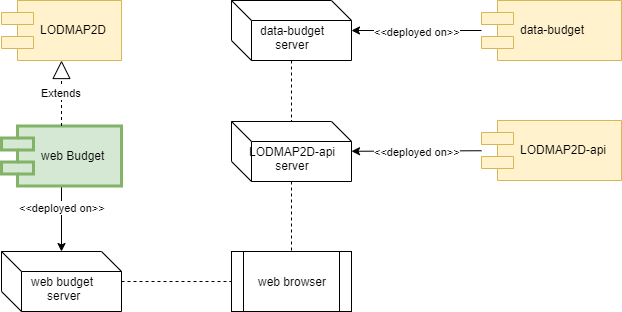

# web-budget

An interactive web application to explore the Italian budget.

**WARNING: this is a complete project refactory. The 2.x versions are no more supported. Please migrate to the new architecture **

This application is inspired by similar project developed by the [g0v community](http://gov.asia/) in [Taiwan](https://github.com/g0v/twbudget) and [Taipey](https://github.com/tony1223/tw-budget-platform)

g0v is a decentralized civic tech community to advocate transparency of information and build tech solutions
for citizens to participate in public affairs from the bottom up. The g0v community was born in Taiwan thanks to [Audrey Tang](https://de.wikipedia.org/wiki/Audrey_Tang), [Chia-liang Kao](https://github.com/clkao) and many others.


Have a look to the reference implementation  https://budget.g0v.it/


web-budget is a mash-up built on three open source projects:

- the [LODMAP2D](https://github.com/linkeddatacenter/LODMAP2D) project for the the presentation layer (i.e. the bubbles) ;
- the [LODMAP2D-api](https://github.com/linkeddatacenter/LODMAP2D-api) that provides a CORS enabled microservice to optimize and cache the data required by web-budget ;
- the [data-budget](https://github.com/g0v-it/data-budget) project that provides a knowledge graph about Italian budget data with a SPARQL service. 
data-budget is an extension of the [SDaaS community edition](https://github.com/linkeddatacenter/sdaas-ce)




## Try with docker

The project is shipped with a [Docker](https://docker.com) setup that makes it easy 
to get a containerized development environment up and running. 
If you do not already have Docker on your computer, 
[it's the right time to install it](https://docs.docker.com/install/).


To try the application, an example stack of services is provided. Just type: 

```
docker-compose build
docker-compose up -d
```

This will start locally all needed services:

| Name        | Description                                                   | Port 
| ----------- | ------------------------------------------------------------- | ------- 
| sdaas       | the data-budget  platform                                     | 29321 
| api         | a microservice providing LODMAP2-api                          | 29322 
| webapp      | the customized LODMAP2D application                           | 20323


- try http://localhost:29323/

The first time you start the containers, Docker downloads and builds images for you. It will take some time, but don't worry
this is done only once. Starting servers will then be lightning fast.

*WARNING: some external links require to access to a public SPARQL interface. Such links are not working in a 
local deploy, if you need it, you have tho expose sdaas port in internet.*

To shutdown the platform type: 

```
docker-compose down
```

Developers should read [CONTRIBUTING file](CONTRIBUTING.md)


## Support

For answers you may not find in here or in the Wiki, avoid posting issues. Feel free to ask for support on the [Slack](https://linkeddatacenter.slack.com/) general room. Make sure to mention **@enrico** so he is notified.

## Credits

All used software components are available with **Open Source License**

Thanks to all project contributors, to the [Copernicani community](https://copernicani.it/) and to the [g0v asia community](http://g0v.asia) for ideas and support.

A special thanks to the great G0V-IT team [Miah Mohd Ehtesham](https://github.com/miahmohd), [Leonardo Longhi](https://github.com/LeonardoLonghi),
[Yassine Ouahidi](https://github.com/YassineOuahidi), [Luca Mearelli](https://github.com/luca) and [Enrico Fagnoni](https://github.com/ecow)

This software includes:

- the [LODMAP2D application](https://github.com/linkeddatacenter/LODMAP2D) for data exploration by [LinkedData.Center](http://LinkedData.Center/)
- the [D3.js library](https://d3js.org/)
- The [Vue framework](https://vuejs.org)
- The [rdflib.js library](https://github.com/linkeddata/rdflib.js) by LinkedData team & TimBL


## License

The MIT License (MIT). Please see License File for more information.
